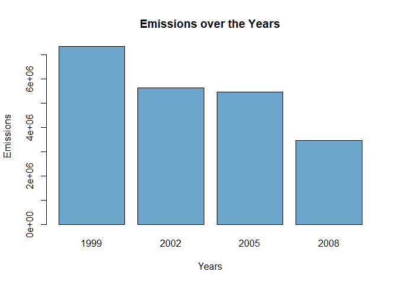
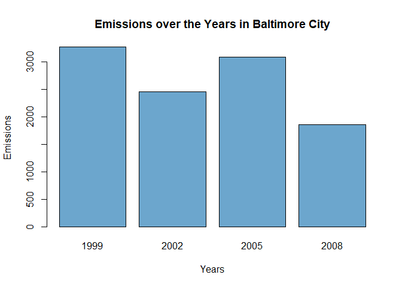
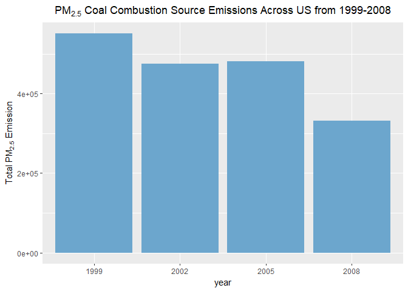
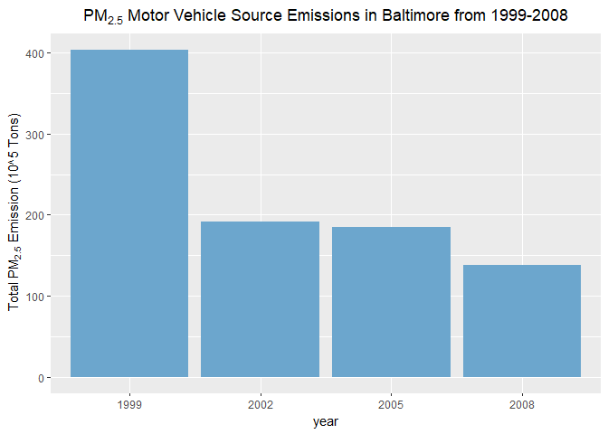

### Exploratory Data Analysis Project 2

#### Reading the data and adding necessary libraries

``` r
# Reading the libraries
library(data.table)
library(dplyr)
library(ggplot2)

# Reading the data
NEI <- readRDS("./summarySCC_PM25.rds")
SCC <- readRDS("./Source_Classification_Code.rds")
```

#### Questions

You must address the following questions and tasks in your exploratory
analysis. For each question/task you will need to make a single plot.
Unless specified, you can use any plotting system in R to make your
plot.

1.Have total emissions from PM2.5 decreased in the United States from
1999 to 2008? Using the base plotting system, make a plot showing the
total PM2.5 emission from all sources for each of the years 1999, 2002,
2005, and 2008.

``` r
png(filename = "plot1.png")
temp <- NEI %>% group_by(year) %>% summarise(Emissions = sum(Emissions))
with(temp, barplot(Emissions,names=year, xlab = "Years", ylab = "Emissions"
                   , main = "Emissions over the Years",col = "skyblue3"))
dev.off()
```

    ## png 
    ##   2



2.Have total emissions from PM2.5 decreased in the Baltimore City,
Maryland (fips == “24510”) from 1999 to 2008? Use the base plotting
system to make a plot answering this question.

``` r
png(filename = "plot2.png")
temp <- NEI %>% filter(fips==24510) %>% group_by(year) %>% summarise(Emissions = sum(Emissions))
with(temp, barplot(Emissions,names=year, xlab = "Years", ylab = "Emissions"
                   , main = "Emissions over the Years in Baltimore City",col = "skyblue3"))
dev.off()
```

    ## png 
    ##   2



3.Of the four types of sources indicated by the type (point, nonpoint,
onroad, nonroad) variable, which of these four sources have seen
decreases in emissions from 1999–2008 for Baltimore City? Which have
seen increases in emissions from 1999–2008? Use the ggplot2 plotting
system to make a plot answer this question.

``` r
temp <- NEI %>% filter(fips==24510) %>% group_by(year,type) %>% summarise(Emissions = sum(Emissions))

png(filename = "plot3.png")
ggplot(data = temp,mapping = aes(x = factor(year),y = Emissions))+geom_bar(stat = "identity",fill = "skyblue3")+facet_grid(~type)+
        xlab(c("1997","2002", "2005","2008"))+labs(x="year", y=expression("Total PM"[2.5]*" Emission (Tons)"))+
        labs(title=expression("PM"[2.5]*" Emissions, Baltimore City 1999-2008 by Source Type"))+
        theme(plot.title = element_text(hjust = 0.5))
dev.off()
```

    ## png 
    ##   2


4.Across the United States, how have emissions from coal
combustion-related sources changed from 1999–2008?

``` r
combustionRelated <- with(SCC, grepl("comb",SCC.Level.One, ignore.case=T))
coalRelated <- with(SCC, grepl("coal",SCC.Level.Four, ignore.case=T))
combustionSCC <- SCC[combustionRelated & coalRelated, 1]
combustionNEI <- filter(.data = NEI,SCC %in% combustionSCC )


png(filename = "plot4.png")
ggplot(combustionNEI,aes(x = factor(year),y = Emissions))+
        geom_bar(stat ="identity",fill = "skyblue3")+
        labs(x="year", y=expression("Total PM"[2.5]*" Emission")) + 
        labs(title=expression("PM"[2.5]*" Coal Combustion Source Emissions Across US from 1999-2008"))+
        theme(plot.title = element_text(hjust = 0.5))
dev.off()
```

    ## png 
    ##   2



5.How have emissions from motor vehicle sources changed from 1999–2008
in Baltimore City?

``` r
png(filename = "plot5.png")


vehicle <- SCC[with(SCC, grepl(pattern = "vehicle",SCC.Level.Two,ignore.case = T)),1]
data <- NEI %>% filter(SCC %in% vehicle & fips == 24510)     

ggplot(data = data,mapping = aes(x = factor(year),y = Emissions))+geom_bar(stat = "identity",fill = "skyblue3")+
        labs(title=expression("PM"[2.5]*" Motor Vehicle Source Emissions in Baltimore from 1999-2008"))+
        labs(x="year", y=expression("Total PM"[2.5]*" Emission (10^5 Tons)"))+
        theme(plot.title = element_text(hjust = 0.5))

dev.off()       
```

    ## png 
    ##   2



6.Compare emissions from motor vehicle sources in Baltimore City with
emissions from motor vehicle sources in Los Angeles County, California
(fips == “06037”). Which city has seen greater changes over time in
motor vehicle emissions?

``` r
vehicle <- SCC[with(SCC, grepl(pattern = "vehicle",SCC.Level.Two,ignore.case = T)),1]

vehiclesBaltimoreNEI <- NEI %>% filter(SCC %in% vehicle & fips == "24510")
vehiclesBaltimoreNEI$city <- "Baltimore City"

vehiclesLANEI <- NEI %>% filter(SCC %in% vehicle & fips == "06037")
vehiclesLANEI$city <- "Los Angeles"

vehicles_Balt_LA_NEI <- rbind(vehiclesBaltimoreNEI,vehiclesLANEI) 

png(filename = "plot6.png")
ggplot(data = vehicles_Balt_LA_NEI,mapping = aes(x = factor(year),y = Emissions))+
        geom_bar(stat = "identity",fill = "skyblue3")+facet_grid(.~city)+
        labs(x="year", y=expression("Total PM"[2.5]*" Emission (Kilo-Tons)")) + 
        labs(title=expression("PM"[2.5]*" Motor Vehicle Source Emissions in Baltimore & LA, 1999-2008"))+
        theme(plot.title = element_text(hjust = 0.5))
dev.off()
```

    ## png 
    ##   2


